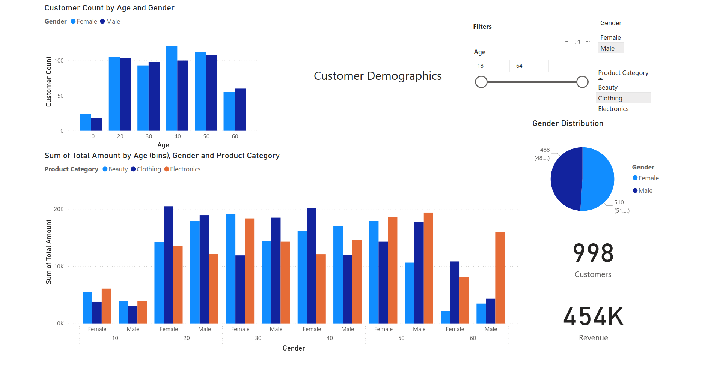
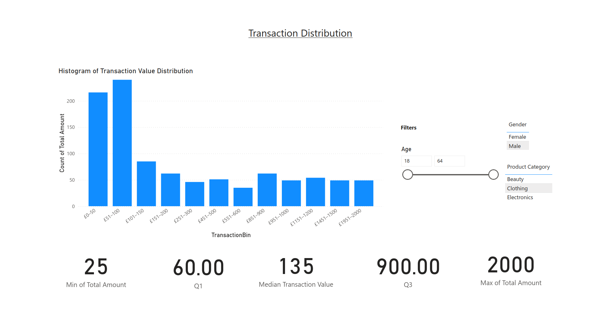
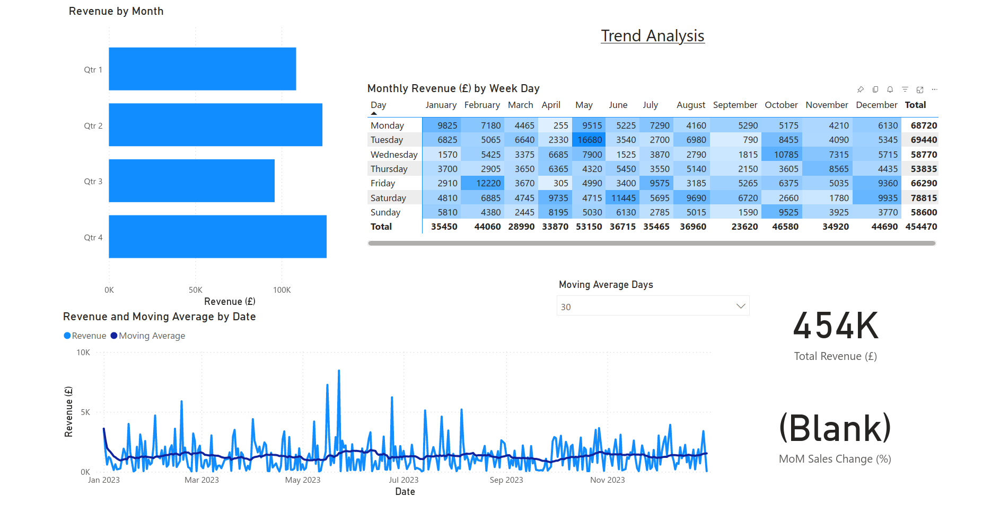

# Retail Sales Analysis

This project analyses sales data from a retail store in 2023 using Power BI. The dataset includes transaction-level retail sales data, publicly available via Kaggle.

## Table of Contents

- [Data Source](#data-source)
- [Methodology](#methodology)
- [Executive Summary](#executive-summary)
- [Sales Breakdown](#sales-breakdown---key-insights)
- [Customer Demographics](#customer-demographics---key-insights)
- [Transaction Distribution](#transaction-distribution---key-insights)
- [Trend Analysis](#trend-analysis---key-insights)
- [Conclusion](#conclusion)

## Data Source

This dataset was sourced from Kaggle and is in the public domain:

[Retail Sales Dataset - Mohammad Talib on Kaggle](https://www.kaggle.com/datasets/mohammadtalib786/retail-sales-dataset/data)

## Methodology

This analysis was conducted using Microsoft Power BI to explore and visualise sales data from a retail store for the year 2023. The workflow included the following steps:

1. Data Preparation

- Imported the dataset from Kaggle into Power BI
  - Cleaned and validated the data, including checking for nulls, outliers, and formatting issues. Two records were removed for being from the incorrect year.

2. Data Modelling

- Created calculated columns and DAX measures for KPIs such as:
  - Moving averages
  - Quartiles (Q1, Q3)

3. Visual Analysis

- Developed multiple report pages to explore:

  - Revenue trends over time
  - Product category performance
  - Customer demographics
  - Transaction distribution patterns

- Used visualisation including:
  - Line and bar charts for trend and category analysis
  - Heatmaps for weekday revenue distribution
  - Boxplots and histograms for transaction spread
  - Card visuals for KPI summaries
  - Slicers for interactivity across gender, age, product category, and date

4. Insight Generation

- Conducted descriptive analysis to identify patterns, outliers, and segments.
- Interpreted visual trends to inform strategic recommendations.
- Focused on linking observations to realistic business implications without overstepping into speculative conclusions.

## Executive Summary

This report analyses retail sales data from 2023 to uncover trends in revenue, customer demographics, and product category performance. Using Power BI, I visualised and interpreted key patterns to support data-driven decision-making.

**Key findings:**

- Total revenue was £454,470 across 998 transactions, with a median transaction value of £135.
- Sales were evenly split across product categories, though electronics showed higher volatility month to month.
- Under-20s were under-represented in the customer base.
- Transaction values were highly skewed, with a long tail of high-value purchases.
- No clear seasonal trends emerged, suggesting stable demand and potential to boost seasonal sales.

## Sales Breakdown - Key Insights

Total revenue for the year was £454,470 from 998 sales, with a median transaction value of £135. Monthly revenue by product category is quite volatile, with electronics showing the greatest fluctuations. Overall, revenue distribution by product category appears random month-to-month, with no clear seasonal trends.

For the year, sales were evenly split across categories:

- Electronics: 34.52%
- Clothing: 34.32%
- Beauty: 31.25%

### Strategic Considerations:

- **Investigate volatility in electronics sales:** The higher month-to-month fluctuations in electronics suggest demand variability or promotional effects worth deeper analysis.
- **Maintain balanced category focus:** The even revenue split suggests no one category dominates, so balanced marketing and stock investment across all categories may help sustain overall revenue stability.
- **Monitor emerging trends:** Regular monitoring could detect early signals of shifting category preferences or seasonality not yet visible in 2023's data.

## Customer Demographics - Key Insights

### High-Value Segment: 60+ Males in Electronics

Men aged 60 and above exhibit the highest average transaction value in the electronics category. Their spending far exceeds that in beauty and clothing, suggesting strong interest and purchasing power in tech-related products.

### Underserved Group: Under 20s

The under-20 age group is significantly under-represented in the dataset. Targeted marketing efforts could help capture this demographic. This may indicate that the offerings don't align with their preferences in style, function, or branding.

### Product Mismatch for Older Customers

Shoppers over 60 show low engagement with beauty products, and older men rarely purchase clothing. This may indicate that current offerings don't align with their preferences; perhaps in terms of style, function, or branding. Adjusting product lines or messaging could better capture this segment.

### Balanced Gender Representation

The dataset shows a nearly even split between male (51.1%) and female (48.9%) customers, with this balance holding across most age groups. There is also a fairly even age distribution from 20 to 60, with noticeable drop-offs below 20 and above 60 as mentioned.

### Strategic Considerations

- **Target 60+ male electronics buyer:** Given that this segment has the highest average transaction value in electronics, focus on their purchasing patterns and product preferences to optimise inventory and tailor product assortments to meet their demand.
- **Explore reasons for low engagement among under-20 customers:** Conduct a deeper investigation into why this segment is under-represented, which represents an untapped market.
- **Adjust beauty and clothing offerings for customers over 60:** Sales data shows low engagement with beauty and clothing products among shoppers over 60. This segment has proven they have high purchasing power when their needs are met.

## Transaction Distribution - Key Insights

The distribution of transaction values is highly right-skewed, indicating that while most customers spend relatively small amounts, a minority make very high-value purchases.

- **Minimum transaction value:** £25
- **Median transaction value:** £135
  This means 50% of transactions fall at or below £135, with a minimum of £25.

- **Upper quartile (Q3):** £900
  An additional 25% of transactions fall between £135 and £900, while the final 25% range from £900 up to £2000, showing a long tail of high-value spending.

Because of this skew, the median provides a more accurate measure of typical transaction size than the mean, which is inflated by outliers.

### Strategic Considerations:

The data reveals two key customer segments:

- **Typical buyers** who transact within a modest price range (under £135).
- **High-value customers** who account for a disproportionately large share of revenue.

Targeting these groups differently could improve overall performance:

- For typical buyers: increase average order value while respecting their price sensitivity: such as through incentives or discounts for higher spending.
- For high spenders: the goal should be on boosting retention to encourage more frequent high value orders.

## Trend Analysis - Key Insights

The heatmap of monthly revenue by weekday reveals no clear patterns, indicating that sales are fairly consistent across days of the week. Similarly, revenue by month shows no strong seasonality, and the 30-day moving average confirms a relatively stable sales trend throughout the year.

### Strategic Considerations:

- **Opportunity to Boost Winter Sales:** Consistent sales suggest a steady customer base without major seasonal spikes or dips. There may be potential to boost winter sales through targeted promotions or holiday campaigns to take advantage of increased consumer spending.

## Conclusion

This retail sales analysis provides a comprehensive overview of customer behaviour and sales performance throughout 2023. Key findings highlight distinct customer segments, such as the high-value electronics buyers aged 60+, and the underserved under-20 demographic, offering actionable insights for targeted strategies.

Sales trends indicate a generally stable revenue flow with no significant seasonal spikes, suggesting opportunities to stimulate demand. The transaction distribution's strong right skew reinforces the importance of focusing on median transaction values for realistic performance measurement and strategic segmentation.

Overall, the balanced sales across product categories and genders points to a well-diversified customer base. However, product engagement varies notably by age group, signalling areas where tailored offerings and further analysis could boost revenue.

Future efforts should focus on deeper segmentation, targeted marketing interventions, and continuous monitoring to adapt to emerging patterns.
